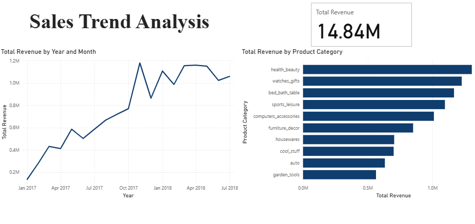
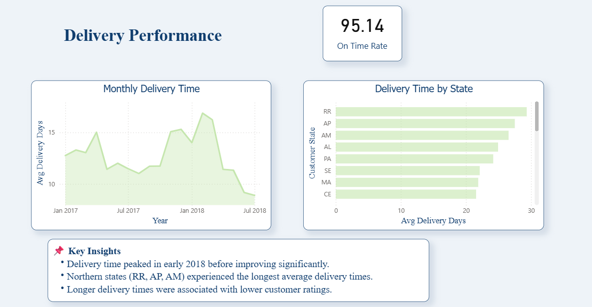
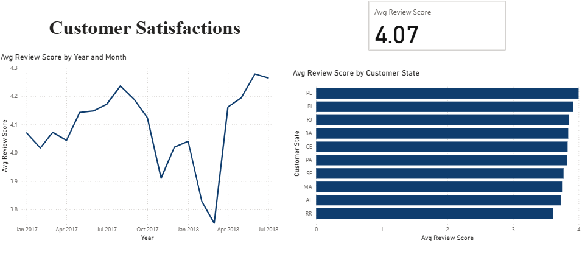

# Brazilian E-Commerce Analysis (Olist Dataset)


An analysis of sales performance, delivery logistics, and customer satisfaction across the Olist marketplace network, built against the [Brazilian E-Commerce Public Dataset by Olist](https://www.kaggle.com/datasets/olistbr/brazilian-ecommerce) (Kaggle).

## Table of Contents

- [Key Results at a Glance](#key-results-at-a-glance)
- [Background](#background)
- [Problem Statement](#problem-statement)
- [Dataset Overview](#dataset-overview)
- [Methodology](#methodology)
- [Results and Discussion](#results-and-discussion)
- [Key Finding: The RR Correlation](#key-finding-the-rr-correlation)
- [Limitations](#limitations)
- [Conclusion and Recommendations](#conclusion-and-recommendations)
- [Repository Structure](#repository-structure)
- [How to Reproduce](#how-to-reproduce)
- [Author](#author)

## Key Results at a Glance

| Metric | Value |
|---|---|
| Total revenue (2016–2018) | R$14.84M |
| On-time delivery rate | 95.14% |
| Average review score | 4.07 / 5 |
| Slowest-served region | North/Northeast states (RR, AP, AM, AL, PA), up to ~29 days average delivery |
| Central finding | The month with the worst delivery time and the state with the worst delivery time are also the worst on customer reviews |

The numbers above look healthy in aggregate. The rest of this document exists mainly to explain why that aggregate view is misleading in a few specific, checkable ways — and what the underlying month-by-month and state-by-state data actually shows instead.

## Background

Olist doesn't sell anything itself. It's a marketplace integrator that lists small and medium-sized Brazilian retailers' products across major e-commerce channels and then handles logistics and the post-purchase experience under one contract. Practically, that means Olist sits in the middle of three things that jointly decide whether a given order turns into a repeat customer or a one-time transaction: what's actually selling, whether the delivery shows up when promised, and how the customer feels about the whole thing afterward.

This project works from roughly 100,000 real, anonymized orders placed between 2016 and 2018, and it's built directly on the raw relational tables rather than a pre-cleaned or pre-aggregated dataset. That was a deliberate choice, not a default — working from the raw CSVs meant confronting data quality problems (string-formatted dates, orders that never completed their lifecycle, categories with too few orders to trust) that a tidier dataset would have hidden. Those problems, and how each one was handled, show up throughout the Methodology section below.

## Problem Statement

The analysis is organized around three questions, one per force described above:

1. **Growth** — How has revenue moved month to month, and which product categories account for most of it?
2. **Logistics** — Is Olist actually hitting its own delivery estimates, and does that hold steady across geography and time, or does it vary?
3. **Satisfaction** — Do review scores move together with delivery performance, or do they seem to move independently of it?

The third question is the one that matters most and is also the hardest to answer honestly. It's where the analysis stops just describing what happened and starts making a claim about why — and that's exactly the point where a purely SQL-based, non-experimental approach needs to be upfront about what it can and can't actually prove. That caveat isn't a formality tacked onto the end; it shapes how the finding in this project should be read.

## Dataset Overview

The raw data comes as eight relational CSV files, imported into a normalized MySQL schema:

| Table | Description |
|---|---|
| `orders` | Core order record — status and purchase/approval/delivery timestamps |
| `order_items` | Line items per order — product, seller, price, and freight value |
| `order_payments` | Payment method and installment count |
| `order_reviews` | Post-purchase review score and free-text comments |
| `customers` | Customer location (city, state) |
| `products` | Product attributes, linked to category |
| `sellers` | Seller location |
| `category_translation` | Maps Portuguese category names to English equivalents |

Tables join on `order_id`, `customer_id`, or `product_category_name` depending on the query. One thing worth flagging up front because it affects how the geographic results should be read: `customers` records the *delivery destination*, not where the seller is based. So when a state shows up later with slow delivery times, that tells you where customers experienced the delay — not necessarily where in the supply chain it actually started.

## Methodology

The setup script, `olist_setup_updated.sql`, creates all eight tables and loads each CSV using `LOAD DATA LOCAL INFILE`, followed by a row-count check against the source files to confirm nothing got truncated on the way in.

A data quality issue shows up almost immediately and ends up shaping every query written after it: the date fields (`order_purchase_timestamp`, `order_delivered_customer_date`, and so on) import as plain strings in `MM/DD/YYYY HH:MM` format instead of native `DATETIME` values. That means no query anywhere in this project can do date arithmetic directly — every comparison first needs an explicit conversion:

```sql
STR_TO_DATE(column, '%m/%d/%Y %H:%i')
```

This sounds like a minor formatting detail, but skipping it doesn't throw an error — it just quietly produces string-sorted results instead of chronologically-sorted ones, which is a much harder bug to catch after the fact. It's treated here as a constraint the whole analysis has to work around, not a one-line fix and move on.

From there, `01_time_series_analysis.sql` runs three monthly aggregations. The sales query pulls order count, total revenue (`price + freight_value` summed across line items), and the resulting average order value. The delivery query computes average delivery time, average days early or late against the estimate, and an on-time rate built with conditional aggregation:

```sql
ROUND(SUM(CASE 
    WHEN STR_TO_DATE(o.order_delivered_customer_date, '%m/%d/%Y %H:%i') 
         <= STR_TO_DATE(o.order_estimated_delivery_date, '%m/%d/%Y %H:%i')
    THEN 1 ELSE 0 END) * 100.0 / COUNT(*), 1) AS on_time_pct
```

The satisfaction query pulls average review score per month, split into positive (score ≥ 4) and negative (score ≤ 2) counts, computed alongside average delivery time for the same period specifically so the two series can be lined up against each other later.

All three queries restrict to `order_status = 'delivered'`. That's a deliberate scope decision, not an oversight: a cancelled order doesn't have a meaningful delivery time or a review, and leaving those rows in would distort both metrics. The tradeoff is that this project has nothing to say about cancellation rates themselves — that's flagged again in Limitations because it's a real gap, not a minor footnote.

`02_state_analysis.sql` joins `orders`, `customers`, and `order_reviews` to get order volume, average review score, average delivery time, and on-time percentage by customer state. This is where the disparities that a national average hides start to become visible.

`03_category_analysis.sql` joins `orders` → `order_items` → `products` → `category_translation` → `order_reviews` to compute average review score and delivery time per category, using the English category names. One filter here is worth explaining rather than glossing over: `HAVING COUNT(DISTINCT o.order_id) >= 100`. Without it, a category with three or four orders and a single bad review would show up looking just as "reliable" as a category built on several thousand orders — the small sample isn't wrong, it's just noisier, and this filter keeps that noise from being mistaken for a real signal.

## Results and Discussion

### Sales trend

Total revenue across the observed period reached **R$14.84M**. Month over month, growth was steady and largely uninterrupted from roughly R$0.1M in January 2017 to a peak of **R$1.18M** in late 2017. After that peak, though, revenue doesn't keep climbing — it settles into a R$1.0–1.15M range through mid-2018. That plateau is arguably more informative than the growth phase before it: it suggests the marketplace had reached something close to a stable demand ceiling by that point, rather than still being early in a growth curve. Confirming that with real confidence would mean checking seller count and active-customer trends alongside revenue, which this dataset doesn't provide in the queries run here — so treat it as a plausible reading of the trend, not a settled fact.



By category, `health_beauty` brings in the most revenue among categories with enough order volume to be meaningful, followed by `watches_gifts` and `bed_bath_table`. The lowest-revenue category in the top ten, `garden_tools`, generates roughly half of what the leading category does. In other words, revenue isn't spread evenly across the catalog — it's concentrated in a handful of categories, which has a fairly direct implication for where inventory and marketing spend would do the most good.

### Delivery performance

The headline number here is a **95.14%** on-time delivery rate, and taken by itself that's a genuinely strong result. But averaging across the full period buries a swing that matters: average delivery time was sitting around 11–13 days through most of 2017, climbed to a peak of roughly **17 days in early 2018**, and then dropped sharply to about **9 days by mid-2018**. Report the full-period average on its own and you'd both understate how bad early 2018 actually was for customers ordering during that window, and give no credit to whatever operational change produced the recovery a few months later.



The state-level breakdown tells a similar story of an average concealing real disparity underneath it. The five slowest states to deliver to are RR (Roraima, ~29 days), AP (Amapá, ~27 days), AM (Amazonas, ~26.5 days), AL (Alagoas, ~25 days), and PA (Pará, ~24 days) — all in Brazil's North or Northeast, geographically far from the São Paulo-centric seller base that dominates the Olist network. A distance-and-infrastructure explanation fits that pattern well, but the dataset on its own can't rule out other contributing factors, like customs processing or limited last-mile carrier capacity in those regions.

### Customer satisfaction

The overall average review score is **4.07 out of 5**. Broken down by month, it dips to roughly **3.78 in early 2018** — the same window where delivery time peaked at 17 days — and then climbs back to about **4.27 by mid-2018**, on the same timeline as the delivery recovery described above.



At the state level, PE (Pernambuco) posts the highest average review score at roughly 4.0, while RR (Roraima) posts the lowest at around 3.6 — the same state that showed up above as the slowest to deliver to.

## Key Finding: The RR Correlation

Two separate ways of slicing the data — one by time, one by geography — end up pointing at the same thing. Look at it by month, and the worst-performing month for delivery (~17 days) is also the worst-performing month for reviews (~3.78). Look at it by state instead, and the worst-performing state for delivery (RR, ~29 days) is also the worst-performing state for reviews (~3.6).

It would be overreaching to call this a proven causal relationship based on two aggregated correlations. Review scores are shaped by plenty of things this analysis doesn't control for — product quality, whether pricing matched expectations, how the item arrived packaged, how responsive the seller was. None of that is isolated here. What can be said with reasonable confidence is narrower but still useful: because the same pattern shows up independently in two different breakdowns of the data, delivery delay is a credible explanation for a meaningful share of the dissatisfaction — more credible than it would be if the pattern had only appeared in one of the two.

## Limitations

Review scores reflect more than delivery time, and this project makes no attempt to isolate delivery's specific contribution from other drivers of satisfaction through regression or a controlled comparison. The RR finding above should be read as a correlation worth investigating further, not a settled causal claim.

All delivery and satisfaction metrics are scoped to `order_status = 'delivered'`, which excludes cancelled and unfulfilled orders entirely. Cancellation rate, and whatever is driving it, is a real gap in this analysis rather than an intentional exclusion of something unimportant.

Revenue here is defined as `price + freight_value` combined. Anyone who specifically needs merchandise revenue net of shipping cost recovery would need to pull these two components apart, which the current queries don't do.

Finally, the geographic analysis is based on customer state — the delivery destination — not seller state. It measures where delays are experienced, not necessarily where in the supply chain they originate, which matters if the next step is deciding where to intervene operationally.

## Conclusion and Recommendations

Olist's logistics network performs well on aggregate — a 95.14% on-time rate is a genuinely strong figure by most standards — but that headline number conceals both a seasonal dip and a persistent geographic gap that wouldn't be visible from the summary statistic alone. Two recommendations follow fairly directly from that:

1. **Prioritize logistics investment in the North and Northeast states identified above** (RR, AP, AM, AL, PA). These are simultaneously the slowest states to deliver to and the least satisfied, which makes them the highest-leverage target for service improvement relative to where they currently stand.
2. **Investigate what actually changed operationally between the early-2018 slowdown and the mid-2018 recovery.** If that recovery was the result of a specific operational fix rather than a seasonal coincidence, identifying it would let Olist apply the same fix proactively the next time delivery performance starts to degrade, instead of waiting to react after the fact.

## Repository Structure

```
olist_setup_updated.sql        Schema creation and CSV import
01_time_series_analysis.sql    Monthly sales, delivery, and satisfaction trends
02_state_analysis.sql          Performance breakdown by customer state
03_category_analysis.sql       Performance breakdown by product category
screenshots/                   Power BI dashboard exports referenced above
```

## How to Reproduce

1. Download the dataset from [Kaggle](https://www.kaggle.com/datasets/olistbr/brazilian-ecommerce).
2. Update file paths in `olist_setup_updated.sql` to match your local CSV location.
3. Run `olist_setup_updated.sql` in MySQL Workbench to create the schema and import the data.
4. Run `01_time_series_analysis.sql`, `02_state_analysis.sql`, `03_category_analysis.sql`, in that order.
5. Connect Power BI (or any BI tool) to the query outputs to reproduce the dashboard.

## Author

Risma Choerunnisa
[GitHub](https://github.com/rismanshaa) · [Live project page](https://rismanshaa.github.io/Analyze-the-Brazillian-E-commerce-Public-Dataset-by-Olist-with-SQL/)

## License

MIT — see [LICENSE](LICENSE).
